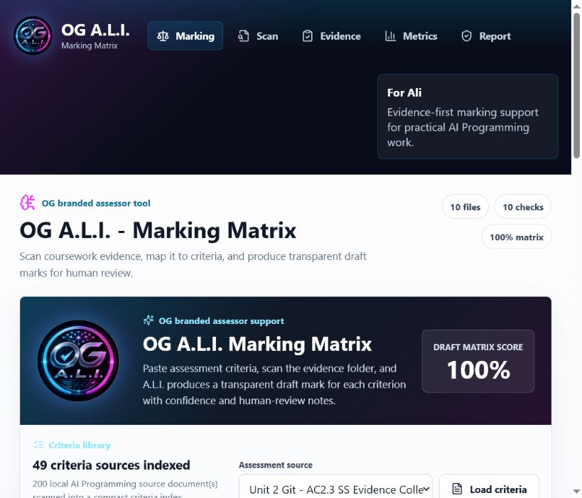

# OG A.L.I. - Marking Matrix

OG A.L.I. is an extracurricular AI Programming project tailored for Ali: an evidence-first marking assistant that checks whether a coursework folder proves the assessment criteria it claims.

The app is not a replacement for an assessor. It is a working support tool that scans scripts, notebooks, data, screenshots, Git evidence, validation metrics, model outputs, and documentation, then maps that evidence against assessment criteria using a visible marking matrix.

It does not publish the raw college course packs, slides, PDFs, or learner evidence folders. Those stay local. The public app includes a lightweight criteria index generated from the local AI Programming source tree, plus safe scanning logic that runs in the browser.


## Links

- GitHub repo: https://github.com/OG-Website/ali-assessment-learning-inspector
- Live demo: https://og-website.github.io/ali-assessment-learning-inspector/



## What it demonstrates

- Unit 1: Python functions, file handling, conditionals, loops, and command-line tooling.
- Unit 2: Git/version-control evidence and clean project documentation.
- Unit 3: NumPy/Pandas-style evidence through notebooks, CSV files, and data outputs.
- Unit 4: vector thinking, validation metrics, model output files, checkpoints, and image evidence.
- Submission practice: evidence-led draft marking instead of vague claims.
- Responsible handling: secret-looking files are blocked before scoring, listing, or report export.

## Assessment criteria source

The criteria library is generated by `scripts/build_assessment_index.py` from the local AI Programming source tree. The current generated index in `src/assessmentCriteria.js` was built from:

- 200 scanned local source files.
- 49 indexed criteria-bearing sources.
- Unit 2 Assessment 2.3 selected as the default source.

This gives Ali a realistic marking matrix without committing every raw assessment folder, full slide deck, PDF, or private evidence pack into the public GitHub repository.

## Run the web app

```powershell
npm install
npm run dev
```

Open the local Vite URL shown in the terminal. The app starts with a sample scan loaded. Use **Choose folder** to scan another coursework folder from the browser.

## Use the live demo

Open the live demo link above in a browser. The app starts with the indexed Assessment 2.3 criteria and sample evidence scan. To test another folder, use **Choose folder** and select a coursework folder from the local machine. The browser checks files locally; it does not upload the folder anywhere.

The browser workflow now includes:

- A criteria source selector for the indexed local assessment sources.
- A full accepted-file review table with search, remove, and manual evidence-type override controls.
- Pre-scan blocking for `.env`, keys, tokens, credentials, and other secret-looking files.
- Safe content checks for readable evidence files so renamed metrics, outputs, notebooks, and model-result files can still be matched.
- Binary or unsupported files are still shown by filename and can be manually assigned to the right evidence type.

## What Ali can try

1. Open the live demo.
2. Review the built-in marking matrix and draft criterion marks.
3. Edit the criteria and learner evidence notes to see the matrix update.
4. Use **Choose folder** to scan a local coursework folder.
5. Search the accepted file list, remove any wrong file, or override its evidence type.
6. Use **Export report JSON** to download the evidence summary.

## Run the Python scanner

```powershell
python scripts\ali_scan.py sample-coursework --json
python scripts\ali_scan.py sample-coursework --report reports\ali-sample-report.md
```

The Python scanner does not upload files. It blocks secret-looking files before scoring, searches readable safe files locally, and exports only the safe manifest plus evidence findings. If `pypdf` is installed, it can also extract PDF text for local matching; otherwise PDF files are still matched by filename and metadata.

## Project layout

- `src/` - React/Vite app and evidence scoring rules.
- `src/assessmentCriteria.js` - generated criteria index used by the marking matrix.
- `scripts/build_assessment_index.py` - local index builder for assessment criteria sources.
- `scripts/ali_scan.py` - dependency-free local scanner.
- `sample-coursework/` - small demonstration evidence set.
- `design/ali-dashboard-concept.png` - generated UI concept used before implementation.
- `design/og-ali-logo-concept.png` - generated OG A.L.I. logo concept.

## Assessor-facing purpose

OG A.L.I. gives Ali a quick view of whether the work contains practical evidence, not just written explanation. It highlights missing proof before submission: no notebook, no metrics, no screenshots, no model output, weak documentation, or empty files. Risky secret-looking files are blocked before they can become part of the scan.

The draft marks are deliberately transparent. The app shows what evidence category contributed to each criterion and flags that a tutor must still confirm quality, authenticity and sufficiency.
